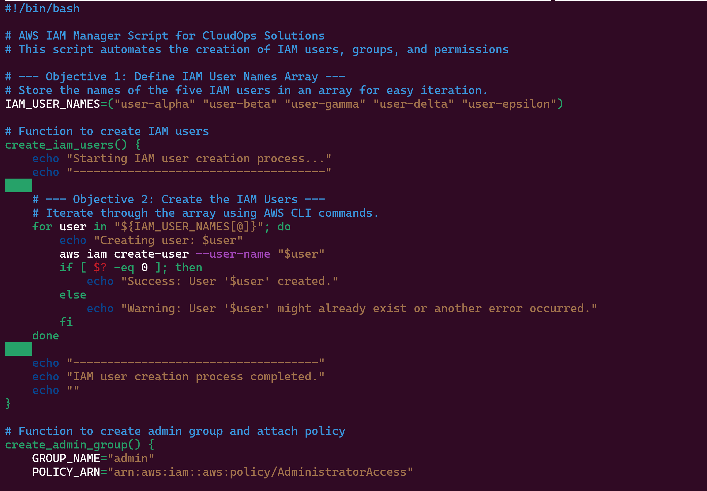
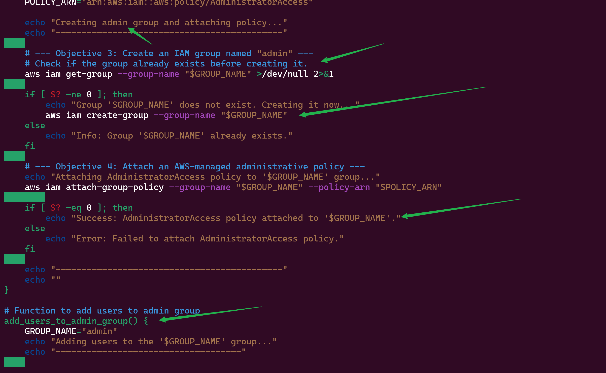
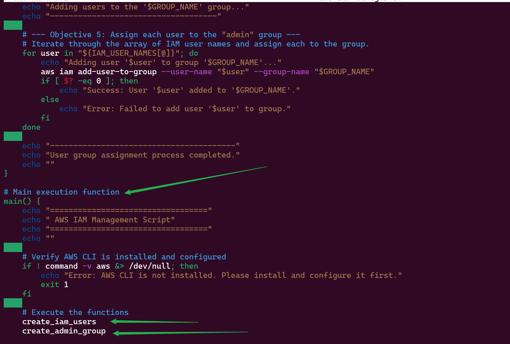
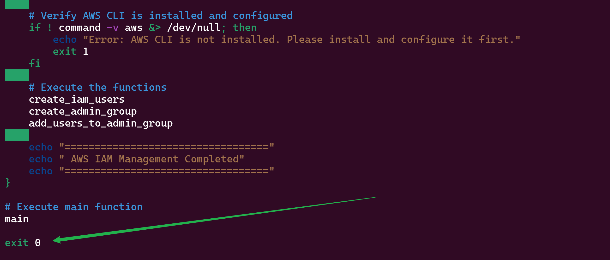
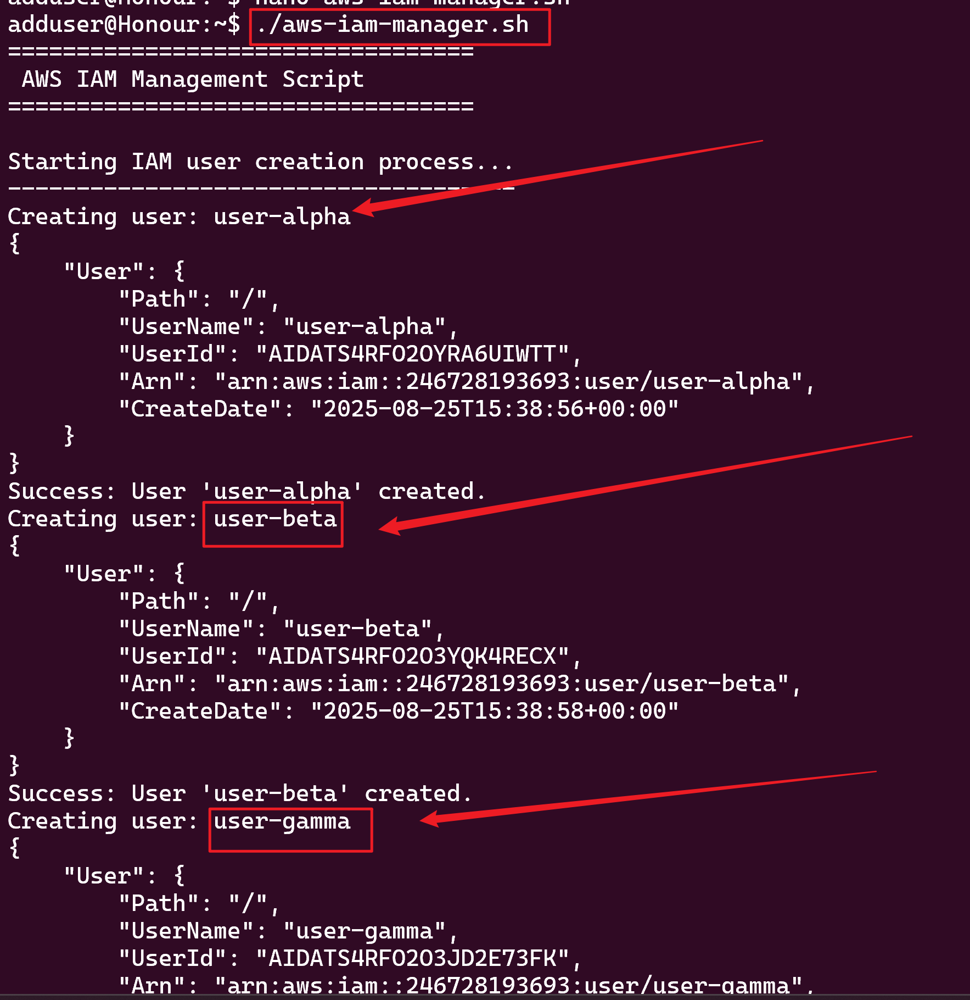
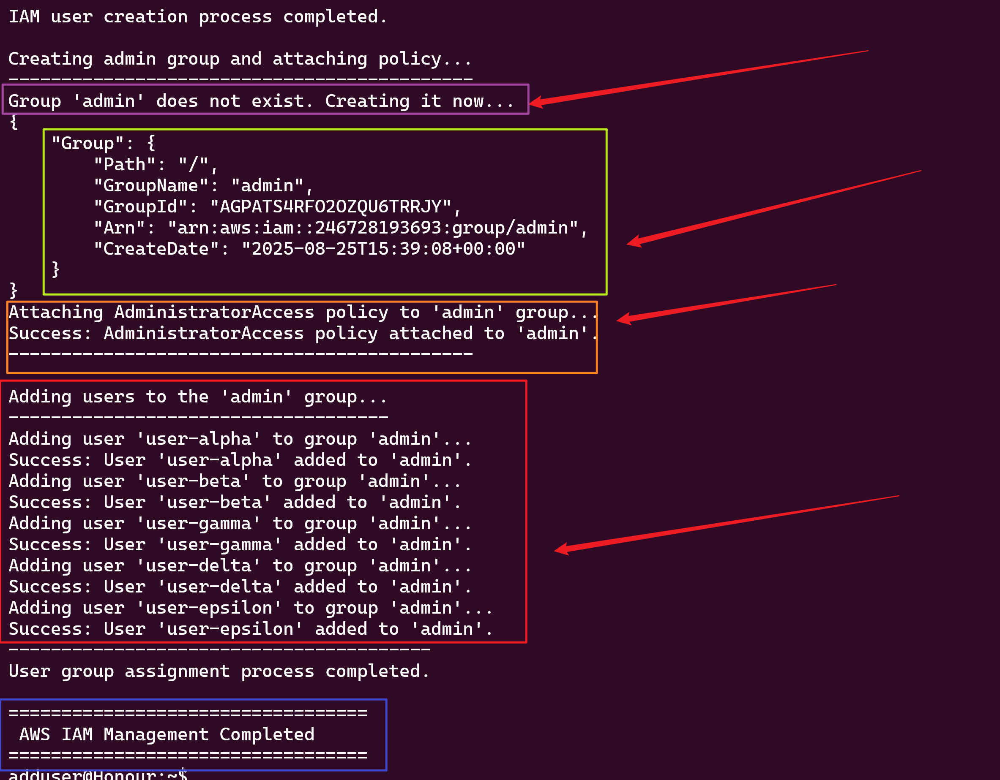

# Shell Scripting AWS IAM Management

## Comprehensive Documentation & Thought Process

### Introduction

This project automates AWS IAM user and group management using a Bash script, greatly simplifying repetitive IAM tasks for CloudOps teams. The script ([aws-iam-manager.sh](https://github.com/Dowlib1/Shell-scripting_AWS_IAM-_management/blob/main/aws-iam-manager.sh)) programmatically creates IAM users, a group, attaches policies, and assigns users to groups—all using AWS CLI commands.

---

## Thought Process Behind Script Development

### 1. Recognizing the Problem

Manual IAM management in the AWS Console is time-consuming and error-prone, especially when onboarding multiple users or teams. Automating these steps ensures consistency, reduces human error, and saves valuable time.

---

### 2. Preparing the Environment

Before scripting, I ensured the environment was ready for AWS CLI operations:

- **Installing AWS CLI and Configuring Credentials**
  
  
  ```bash
  aws configure
  ```
  This sets up your AWS credentials and region.

- **Validating AWS CLI Access**
  
  
  ```bash
  aws s3 ls
  ```
  This command checks if the CLI is properly configured and can access AWS resources.

---

### 3. Script Creation and Tooling

- **Creating the Script File**
  
  
  ```bash
  nano aws-iam-manager.sh
  ```

- **Installing jq (for future JSON parsing needs)**
  
  
  ```bash
  sudo apt update
  sudo apt install jq
  ```
  

---

### 4. Script Design & Logic

#### Objectives and Modularization

The script is broken down into clear, functional modules:

- **Defining IAM Users**
  
  - Users are stored in an array for easy iteration and future scalability.
  - Example user array:
    ```bash
    IAM_USER_NAMES=("user-alpha" "user-beta" "user-gamma" "user-delta" "user-epsilon")
    ```

- **Creating IAM Users**

  
  
  - Iterates over the user array, creates each user via AWS CLI.
  - Handles errors if the user already exists.

- **Creating the Admin Group**

  
  
  - Checks for existence, creates if needed.
  - Attaches the AWS-managed `AdministratorAccess` policy.

- **Adding Users to the Group**

  
  
  - Assigns each user to the admin group.
  - Error handling ensures smooth operation and clear messaging.

- **Main Execution Flow**

  
  
  - Verifies AWS CLI presence.
  - Executes user creation, group creation, and assignment functions sequentially.

#### Error Handling

- At every step, the script checks if the AWS CLI command succeeded (`$? -eq 0`) and provides feedback.
- Warns if users or groups already exist, or if there are permission issues.

---

### 5. Making the Script Executable and Running It

- **Make Executable**
  
  
  ```bash
  chmod +x aws-iam-manager.sh
  ```
  

- **Execute Script**
  
  
  ```bash
  ./aws-iam-manager.sh
  ```

---

### 6. Expected Results

- IAM users are created (or skipped if they exist).
- An admin group is created (or confirmed if it exists).
- AdministratorAccess policy is attached to the group.
- All users are added to the admin group.

  

---

## Script Link

- **View the script source:**  
  [`aws-iam-manager.sh`](https://github.com/Dowlib1/Shell-scripting_AWS_IAM-_management/blob/main/aws-iam-manager.sh)

---

## Script Thought Process Explained

The script is designed for automation, scalability, and reliability:

1. **Purpose & Automation:**  
   It automates the creation of users, groups, and permission assignment for speed and consistency.

2. **User Array for Scalability:**  
   Uses a Bash array for IAM users, making it easy to batch-process and update users.

3. **Modular Functions:**  
   Breaks tasks into logical steps—user creation, group creation, policy attachment, and group assignment—so each part is clear and maintainable.

4. **Error Handling:**  
   Checks if each AWS CLI command succeeds, and provides clear feedback to the user.

5. **Idempotency:**  
   Checks if a group exists before creating it, so running the script multiple times won't cause duplication errors.

6. **Policy Attachment:**  
   Attaches the AWS-managed `AdministratorAccess` policy to the group, ensuring all group members are admins.

7. **Main Function:**  
   Centralizes logic for easy script execution and maintenance.

8. **Execution and Exit:**  
   Ensures proper startup and clean exit, preventing misconfigurations if prerequisites aren’t met.

**Ideal Use Cases:**  
- Team onboarding  
- CloudOps automation  
- Infrastructure as Code setups

---

## Summary & Future Improvements

- **Automation:** Significantly reduces manual IAM operations.
- **Maintainability:** Modular functions allow easy updates for more users, groups, or policies.
- **Extensibility:** Can be enhanced to create custom policies, handle roles, or integrate with CI/CD pipelines.
- **Best Practices:** Always audit IAM permissions and avoid granting excessive privileges.

---

## Conclusion

This approach empowers teams to manage AWS IAM resources efficiently and reliably. The script provides a strong foundation for more advanced automation and can be tailored to diverse organizational needs.

*Feedback and contributions to enhance the script are welcome!*
